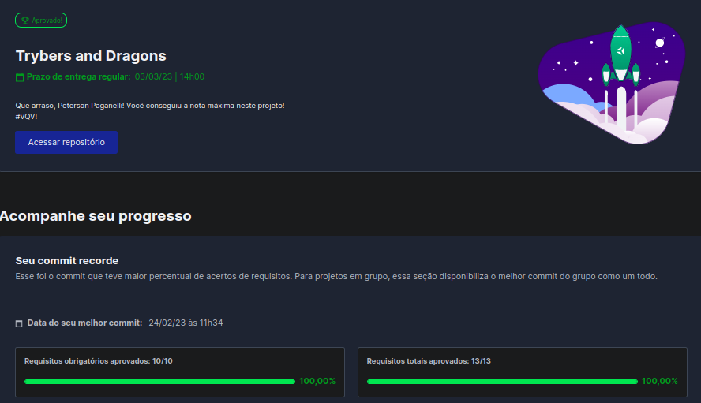

<h1>Trybers-and-Dragons</h1>
<h1>Descrição</h1>

  
Projeto desenvolvido na Trybe durante o módulo de Back-End

  
Nesse projeto foi desenvolvido uma estrutura de um jogo de RPG seguindo os princípios da arquitetura SOLID e do POO
  

<h1>Ferramentas</h1>

  <ul>
    <li>Docker-compose</li>
    <li>Typescript</li>
    <li>NodeJs</li>
    <li>Express</li>
  </ul>

<h1>Resultado</h1>

<h1>Contato</h1>

  
  
  
Email: petersonpaganelli@outlook.com

